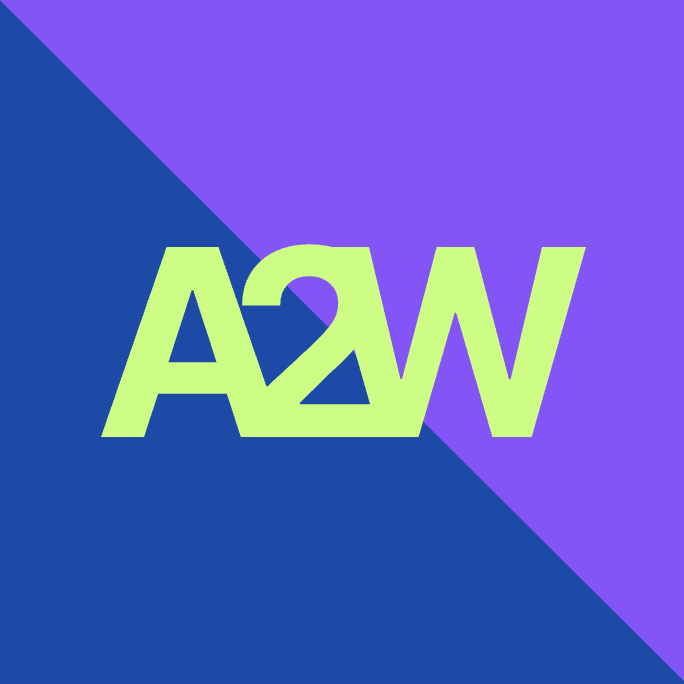

#  A2W Code

A2W Code is a self-hosted workspace for developers and platform engineers. It gives you a Next.js UI around a real repository, Codex-powered chat, Git controls, file browsing, and gated Terraform/NPM sandbox actions.

The app is single-admin and single-instance. Runtime state lives in `.data/`; provider credentials are encrypted with the instance key and are only injected into sandbox runs.

## How It Works

- The web app is Next.js, React, TypeScript, and Tailwind.
- Chat and code edits run through `codex app-server`, using App Server threads and turns.
- Codex auth is handled in onboarding with App Server device-code login and persists in the normal Codex auth directory.
- Codex runs with full repository access. Put A2W inside the container, VM, or Kubernetes namespace you trust.
- Terraform and NPM checks run in a separate sandbox image through local Podman or short-lived Kubernetes Jobs.
- Terraform projects follow the DStack layout:
  - modules: `infrastructure/terraform/modules/<provider>/<module>`
  - roots: `infrastructure/terraform/providers/<provider>/<region>/<stack>`

There is no tmux bridge in the current app path.

## Local Development

```sh
cd apps/web
cp .env.example .env.local
npm install
npm run dev
```

Open `http://127.0.0.1:5173`.

For a production-style local run:

```sh
npm run build
npm start
```

## Required Env

Set real values before exposing the app:

```sh
A2W_ADMIN_USERNAME=admin
A2W_ADMIN_PASSWORD=change-me
AUTH_SECRET=replace-me
A2W_ENCRYPTION_KEY=replace-me
A2W_AGENT_BACKEND=codex
A2W_CODEX_REASONING_SUMMARY=detailed
A2W_CODEX_TURN_START_TIMEOUT_MS=60000
A2W_ENABLE_TERRAFORM_APPLY=false
```

Optional model override:

```sh
A2W_CODEX_MODEL=gpt-5.3-codex-spark
```

The UI also supports `/model` to pick or reset the Codex model for the workspace.

## Sandbox

Local Podman:

```sh
podman build -t a2w-infra-sandbox:latest -f sandbox/Containerfile sandbox
A2W_SANDBOX_BACKEND=podman
A2W_SANDBOX_IMAGE=a2w-infra-sandbox:latest
```

Kubernetes:

```sh
A2W_SANDBOX_BACKEND=kubernetes
A2W_SANDBOX_IMAGE=registry.k6nis.dev/a2w/infra-sandbox:sha-<commit>
A2W_K8S_NAMESPACE=a2w-codex-terraform
A2W_K8S_DATA_PVC=a2w-codex-terraform-data
```

In Kubernetes mode, A2W creates a temporary Job, mounts the workspace PVC, injects temporary credentials, streams logs back into the UI, and removes the Job resources.

## Images

The app image includes the Next.js server, Codex CLI with App Server support, Terraform, Git, SSH, `rg`, `jq`, `curl`, and basic network/process tools.

GitHub Actions builds and pushes:

```text
registry.k6nis.dev/a2w/codex-terraform:v<version>
registry.k6nis.dev/a2w/codex-terraform:sha-<commit>
registry.k6nis.dev/a2w/infra-sandbox:v<version>
registry.k6nis.dev/a2w/infra-sandbox:sha-<commit>
```

Workflow:

```text
.github/workflows/container-images.yml
```

## Checks

```sh
cd apps/web
npm test
npm run build
```

Full release check:

```sh
npm run release:check
```

## Safety

Codex has full access to the checked-out workspace. The deployment boundary is the host/container/Kubernetes namespace you run A2W in.

Terraform apply and destroy still require all of these:

- `A2W_ENABLE_TERRAFORM_APPLY=true`
- workspace setting enabled
- explicit UI approval
- typed confirmation

Treat `.data/` and the Codex auth mount as sensitive.
